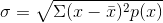
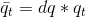
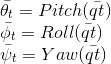
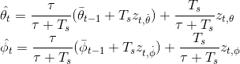
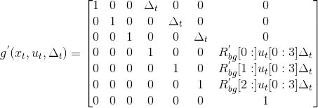
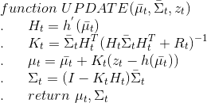
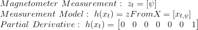
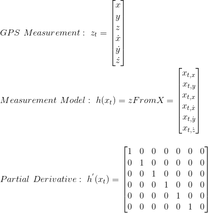

## Project: Estimation


---


# Required Steps:
1. Determine the standard deviation of the measurement noise of both GPS X data and Accelerometer X data.
2. Implement a better rate gyro attitude integration scheme in the UpdateFromIMU() function.
3. Implement all of the elements of the prediction step for the estimator.
4. Implement the magnetometer update.
5. Implement the GPS update.


## [Rubric](https://review.udacity.com/#!/rubrics/1807/view) Points
### Here I will consider the rubric points individually and describe how I addressed each point in my implementation.  

:black_circle: Proposed EKF parameters

| QPosXYStd | QPosZStd | QVelXYStd | QVelZStd | QYawStd | GPSPosXYStd | GPSPosZStd | GPSVelXYStd | GPSVelZStd | MagYawStd | dtIMU | attitudeTau | 
| --- | --- | --- | --- |--- | --- | --- | --- |--- | --- | --- | --- |
|0.05 | 0.05 | 0.18 | 0.1 | 0.2 | 0.7| 2.0 | 0.1 | 0.3 | 0.1 | 0.002 | 100|

:black_circle: Proposed controller gains

| kpPosXY| kpPosZ | KiPosZ | kpVelXY | kpVelZ | kpBank | kpYaw | kpPQR |
| --- | --- | --- | --- |--- | --- | --- | --- |
|14.0  |12.0 | 8.0 | 5.0 | 7.0 | 12.0| 5.0 | 65.0, 60.0, 10.0 |

---

### 1. Determine the standard deviation of the measurement noise of both GPS X data and Accelerometer X data.
The calculated standard deviation should correctly capture ~68% of the sensor measurements. Your writeup should describe the method used for determining the standard deviation given the simulated sensor measurements.

Formula to determine the standard deviation for a discrete variable is next:



An easy way to determine the standard deviation from the simulation generated logs Graph1.txt and Graph2.txt is by using the pandas df describe() method as follows:

```
import pandas as pd

data = pd.read_csv('Graph1.txt', header = 2)
print (data.describe())

std     0.718089

data = pd.read_csv('Graph2.txt', header = 2)
print (data.describe())

std     0.489419
```

### 2. Implement a better rate gyro attitude integration scheme in the UpdateFromIMU() function.
The improved integration scheme should result in an attitude estimator of < 0.1 rad for each of the Euler angles for a duration of at least 3 seconds during the simulation. The integration scheme should use quaternions to improve performance over the current simple integration scheme.

From the Estimation for Quadrotors leaf document we can use the equation (43) to find the the predicted quaternion dq using the IMU gyro angular rates in the body frame, and the rotational matrix qt defined by the quadrotor state for the euler angles expresed in quaternions. 



Where the predicted Roll, Pitch, and Yaw resulting from integration method as provided in [1] eq (44) and (45):


From reference [2] Quan, we know the roll/pitch angle obtained by an accelerometer has a large noise but a small drift, it's compensated by a high pass filter to clean this signal; on the other hand the the roll/pitch angle estimated by integrating angular velocity has a little noise but a large drift,
it is compensated by a low pass filter to clean the signal. In combination we obtain the equations for a non-linear filter as provided by [1] equations (46) and (47).



#### :heavy_plus_sign::heavy_plus_sign: UpdateFromIMU() function implementation.
Refer to lines 99-108 in QuadEstimatorEKF.cpp


### 3. Implement all of the elements of the prediction step for the estimator.
The prediction step should include the state update element (PredictState() function), a correct calculation of the Rgb prime matrix, and a proper update of the state covariance. The acceleration should be accounted for as a command in the calculation of gPrime. The covariance update should follow the classic EKF update equation.

From [1] Algoritm 2, the predition function has the following form:


In the C++ code implementation, the PredictState() function is given by the transition function g(), passing to it the control parameters u_t, the current state x_t, and the sensor time delta_t


We use the gyro acceleration to feed in the Jacobian given from [1] eq (51) as:



where Rgb prime matrix is given from [1] eq (52):


Finally we can update the state covariance as follows:


Where Qt is the transition model covariance.

#### :heavy_plus_sign::heavy_plus_sign: UpdateFromIMU() function implementation.
Refer to lines 175-180 in QuadEstimatorEKF.cpp for the PredictState() function implementation.
Refer to lines 208-213 in QuadEstimatorEKF.cpp for the GetRbgPrime() function implementation.
Refer to lines 262-273 in QuadEstimatorEKF.cpp for the Predict() function implementation.

### 4. Implement the magnetometer update.
The update should properly include the magnetometer data into the state. Note that the solution should make sure to correctly measure the angle error between the current state and the magnetometer value (error should be the short way around, not the long way).

Implementing the magnetometer update requires to pass the proper parameters to the EKF's Update function given from [1] Algorithm 2:



Where the parameters passed to the EKF's Update function are:



Normalize the difference between your measured and estimated yaw, we don't want to update your yaw the long way around the circle:


#### :heavy_plus_sign::heavy_plus_sign: Magnetometer update
Refer to lines 335-340 in QuadEstimatorEKF.cpp

### 5. Implement the GPS update.
The estimator should correctly incorporate the GPS information to update the current state estimate.

Similarly with step 4, GPS update requires to pass the proper parameters to the EKF's Update function, this time the parameters are given from [1] equations (53), (54), and (55).



#### :heavy_plus_sign::heavy_plus_sign: Magnetometer update
Refer to lines 299-312 in QuadEstimatorEKF.cpp

### Execute the flight
#### 1. Does it work?
It works!


### References
[1] [Estimation for Quadrotors](https://www.overleaf.com/read/vymfngphcccj#/54894644/) leaf document
[2] Quan Quan. Introduction to multicopter design and control. Springer, 2017.
